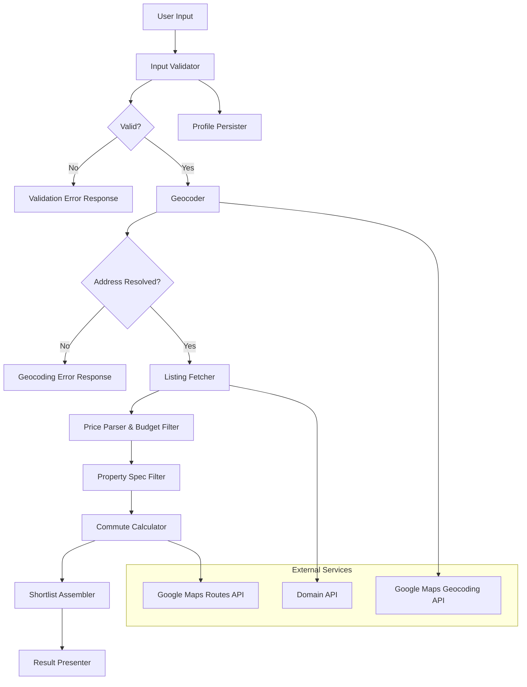

# Design Document

## Overview

The Property Search Shortlist system is a TypeScript/Node.js application that orchestrates property listing retrieval, multi-criteria filtering (budget, commute time, property specs), and shortlist generation for first-time home buyers in Melbourne and Sydney.

The system operates as a pipeline: user criteria are validated, listings are fetched from external APIs, each listing is scored against all filters simultaneously, and results are sorted and capped. The design prioritises the 60-second end-to-end response constraint by parallelising commute calculations and caching geocoded addresses.

**Key design decisions:**
- **TypeScript** — type safety for complex data transformations and price parsing
- **Domain API** as primary listing source — official Australian property data API with structured fields
- **Google Maps Routes API** — provides distance matrix calculations with transit, driving, cycling, and walking modes including departure-time awareness
- **Google Maps Geocoding API** — converts work addresses to coordinates
- **Local JSON file** for user profile persistence (MVP) — simplest durable storage; database can be introduced in Phase 2

## Architecture



The pipeline is structured as a sequence of stages, where each stage reduces the set of candidate listings. Budget and property spec filtering happen before commute calculation to minimise expensive routing API calls.

**Pipeline ordering rationale:**
1. Validate input (fast, local)
2. Geocode work address (single API call)
3. Fetch listings (single API call, returns ≤500)
4. Parse prices & filter by budget (fast, local — eliminates listings cheaply)
5. Filter by property specs (fast, local — further reduces set)
6. Calculate commute times (expensive — batched, only for surviving listings)
7. Filter by commute time (local comparison)
8. Sort, cap at 20, present results

## Components and Interfaces

### InputValidator

Validates user-provided Search_Criteria against all constraints.

```typescript
interface SearchCriteria {
  maxBudget: number;          // AUD, 100,000–10,000,000
  workAddress: string;        // Street address string
  maxCommuteMinutes: number;  // 5–120
  commuteMode: CommuteMode;   // "driving" | "public_transport" | "cycling" | "walking"
  minBedrooms?: number;       // 1–6, optional
  minLandSize?: number;       // 0–2000 sqm, optional
  storeyPreference?: StoreyPreference; // "single" | "double" | "any", optional
}

type CommuteMode = "driving" | "public_transport" | "cycling" | "walking";
type StoreyPreference = "single" | "double" | "any";

interface ValidationResult {
  valid: boolean;
  errors: ValidationError[];
}

interface ValidationError {
  field: string;
  message: string;
}

function validateSearchCriteria(criteria: Partial<SearchCriteria>): ValidationResult;
```

### Geocoder

Converts a street address to geographic coordinates using Google Maps Geocoding API.

```typescript
interface GeoCoordinates {
  latitude: number;
  longitude: number;
}

interface GeocodeResult {
  success: boolean;
  coordinates?: GeoCoordinates;
  formattedAddress?: string;
  error?: string;
}

function geocodeAddress(address: string): Promise<GeocodeResult>;
```

### ListingFetcher

Retrieves property listings from external listing sources.

```typescript
interface PropertyListing {
  id: string;
  address: string;
  priceText: string;          // Raw price string from listing
  bedrooms: number;
  landSizeSqm: number;
  storeys: number;
  coordinates: GeoCoordinates;
  listedDate: string;         // ISO date
  listingUrl?: string;
}

interface FetchResult {
  success: boolean;
  listings: PropertyListing[];
  error?: string;
}

function fetchListings(
  region: "melbourne" | "sydney",
  maxResults?: number          // default 500
): Promise<FetchResult>;
```

### PriceParser

Parses Australian property price strings into structured numeric values.

```typescript
type PriceFormat = 
  | { type: "fixed"; amount: number }
  | { type: "range"; lower: number; upper: number }
  | { type: "plus"; minimum: number }
  | { type: "offers_over"; amount: number }
  | { type: "unparseable" };

function parsePrice(priceText: string): PriceFormat;

function getComparisonPrice(parsed: PriceFormat): number | null;
```

Price format examples:
- `"$750,000"` → `{ type: "fixed", amount: 750000 }`
- `"$650,000 - $700,000"` → `{ type: "range", lower: 650000, upper: 700000 }`
- `"$700,000+"` → `{ type: "plus", minimum: 700000 }`
- `"Offers over $600,000"` → `{ type: "offers_over", amount: 600000 }`
- `"Contact Agent"` → `{ type: "unparseable" }`

Comparison price extraction:
- `fixed` → amount
- `range` → upper bound
- `plus` → minimum (excluded if minimum > budget)
- `offers_over` → stated amount
- `unparseable` → null (listing excluded)

### BudgetFilter

Filters listings by comparing parsed price against the user's maximum budget.

```typescript
interface BudgetFilterResult {
  included: PropertyListing[];
  excluded: PropertyListing[];
  unparseable: PropertyListing[];
}

function filterByBudget(
  listings: PropertyListing[],
  maxBudget: number
): BudgetFilterResult;
```

### PropertySpecFilter

Filters listings by bedrooms, land size, and storeys.

```typescript
interface SpecFilterCriteria {
  minBedrooms?: number;
  minLandSize?: number;
  storeyPreference?: StoreyPreference;
}

function filterBySpecs(
  listings: PropertyListing[],
  criteria: SpecFilterCriteria
): PropertyListing[];
```

### CommuteCalculator

Calculates travel time from property coordinates to work coordinates using Google Maps Routes API.

```typescript
interface CommuteResult {
  propertyId: string;
  durationMinutes: number | null;  // null if route not found within timeout
  mode: CommuteMode;
}

function calculateCommuteTimes(
  properties: { id: string; coordinates: GeoCoordinates }[],
  destination: GeoCoordinates,
  mode: CommuteMode
): Promise<CommuteResult[]>;
```

Design notes:
- Uses Google Maps Routes API `computeRouteMatrix` for batch calculations (up to 25 origins per request)
- Sets departure time to next weekday 8:00 AM AEST for worst-case commute
- 10-second timeout per individual route computation
- Properties with null duration are excluded from shortlist

### ShortlistAssembler

Combines filtered listings with commute times, sorts, and caps results.

```typescript
interface ShortlistedProperty {
  id: string;
  address: string;
  priceText: string;
  priceAud: number;
  bedrooms: number;
  landSizeSqm: number;
  storeys: number;
  commuteMinutes: number;
  listingUrl?: string;
}

interface ShortlistResult {
  properties: ShortlistedProperty[];
  totalEvaluated: number;
  totalMatching: number;
  hasMore: boolean;
  suggestedRelaxation?: string;  // when zero results
}

function assembleShortlist(
  listings: PropertyListing[],
  commuteTimes: CommuteResult[],
  maxCommuteMinutes: number,
  maxResults?: number            // default 20
): ShortlistResult;
```

### ProfilePersister

Saves and loads user search criteria to/from local JSON storage.

```typescript
interface UserProfile {
  id: string;
  searchCriteria: SearchCriteria;
  lastUpdated: string;           // ISO timestamp
}

function saveProfile(profile: UserProfile): Promise<void>;
function loadProfile(userId: string): Promise<UserProfile | null>;
function updateProfileFields(
  userId: string,
  fields: Partial<SearchCriteria>
): Promise<UserProfile>;
```

### Pipeline Orchestrator

Coordinates the full search pipeline with timeout enforcement.

```typescript
interface PipelineResult {
  success: boolean;
  shortlist?: ShortlistResult;
  error?: PipelineError;
  durationMs: number;
}

interface PipelineError {
  stage: "validation" | "geocoding" | "listing_fetch" | "commute" | "assembly";
  message: string;
}

function runSearchPipeline(
  criteria: SearchCriteria,
  timeoutMs?: number             // default 60000
): Promise<PipelineResult>;
```

## Data Models

### Core Domain Types

```typescript
// Geographic coordinates
interface GeoCoordinates {
  latitude: number;   // -90 to 90
  longitude: number;  // -180 to 180
}

// Raw listing from external API
interface RawListing {
  id: string;
  address: string;
  suburb: string;
  state: "VIC" | "NSW";
  priceText: string;
  bedrooms: number | null;
  landSizeSqm: number | null;
  storeys: number | null;
  coordinates: GeoCoordinates | null;
  listedDate: string;
  status: "for_sale" | "sold" | "withdrawn" | "off_market";
  listingUrl: string;
}

// Validated listing (all required fields present)
interface PropertyListing {
  id: string;
  address: string;
  priceText: string;
  bedrooms: number;
  landSizeSqm: number;
  storeys: number;
  coordinates: GeoCoordinates;
  listedDate: string;
  listingUrl?: string;
}

// Search criteria with validated constraints
interface SearchCriteria {
  maxBudget: number;
  workAddress: string;
  maxCommuteMinutes: number;
  commuteMode: CommuteMode;
  minBedrooms?: number;
  minLandSize?: number;
  storeyPreference?: StoreyPreference;
}

// User profile for persistence
interface UserProfile {
  id: string;
  searchCriteria: SearchCriteria;
  lastUpdated: string;
}

// Final shortlisted property for presentation
interface ShortlistedProperty {
  id: string;
  address: string;
  priceText: string;
  priceAud: number;
  bedrooms: number;
  landSizeSqm: number;
  storeys: number;
  commuteMinutes: number;
  listingUrl?: string;
}
```

### Price Parsing Types

```typescript
type PriceFormat =
  | { type: "fixed"; amount: number }
  | { type: "range"; lower: number; upper: number }
  | { type: "plus"; minimum: number }
  | { type: "offers_over"; amount: number }
  | { type: "unparseable" };
```

### API Response Types

```typescript
// Domain API response shape (simplified)
interface DomainListingResponse {
  id: number;
  listing: {
    listingType: string;
    propertyDetails: {
      displayableAddress: string;
      suburb: string;
      state: string;
      bedrooms: number;
      landArea: number;
      buildingArea: number;
      features: string[];
      latitude: number;
      longitude: number;
    };
    priceDetails: {
      displayPrice: string;
      price: number | null;
    };
    dateListed: string;
    listingSlug: string;
  };
}

// Google Maps Routes API response shape (simplified)
interface RoutesMatrixResponse {
  originIndex: number;
  destinationIndex: number;
  status: { code: number };
  duration: string;  // e.g., "1800s"
  condition: string;
}

// Google Maps Geocoding response shape (simplified)
interface GeocodingResponse {
  results: Array<{
    geometry: {
      location: { lat: number; lng: number };
    };
    formatted_address: string;
  }>;
  status: string;
}
```


## Correctness Properties

*A property is a characteristic or behavior that should hold true across all valid executions of a system — essentially, a formal statement about what the system should do. Properties serve as the bridge between human-readable specifications and machine-verifiable correctness guarantees.*

### Property 1: Input validation accepts valid criteria and rejects invalid criteria

*For any* SearchCriteria where all required fields are present and all values fall within their specified ranges (budget 100,000–10,000,000, commute 5–120, bedrooms 1–6, land size 0–2000), validation SHALL return valid=true with no errors. *For any* SearchCriteria where at least one required field is missing or at least one value falls outside its specified range, validation SHALL return valid=false with errors identifying each violated constraint.

**Validates: Requirements 1.1, 1.2, 1.3, 1.5**

### Property 2: Listing completeness filter excludes incomplete listings

*For any* raw listing, if all required fields (price text, bedrooms, land size, storeys, coordinates) are present and non-null, the listing SHALL be included in the validated set. If any required field is null or missing, the listing SHALL be excluded from the validated set.

**Validates: Requirements 2.4, 2.5, 5.6**

### Property 3: Price parsing round trip

*For any* valid PriceFormat value (fixed, range, plus, or offers_over with amounts between 100,000 and 10,000,000), formatting it into an Australian price string and then parsing it back SHALL produce an equivalent PriceFormat with the same type and numeric values. Additionally, the comparison price extracted SHALL equal: the amount for fixed, the upper bound for range, the minimum for plus, and the stated amount for offers_over.

**Validates: Requirements 3.2**

### Property 4: Budget filtering invariant

*For any* PropertyListing with a parseable price and *for any* maximum budget value, the listing SHALL be included in the budget-filtered set if and only if its comparison price is less than or equal to the maximum budget. Listings with unparseable prices SHALL always be excluded.

**Validates: Requirements 3.1, 3.3**

### Property 5: Property specification filtering

*For any* PropertyListing and *for any* combination of optional filter criteria (minBedrooms, minLandSize, storeyPreference), the listing SHALL be included if and only if: (a) minBedrooms is undefined OR listing.bedrooms >= minBedrooms, AND (b) minLandSize is undefined OR listing.landSizeSqm >= minLandSize, AND (c) storeyPreference is "any" or undefined OR (storeyPreference is "single" AND listing.storeys == 1) OR (storeyPreference is "double" AND listing.storeys >= 2).

**Validates: Requirements 5.1, 5.2, 5.3, 5.4, 5.5, 5.7**

### Property 6: Commute time filtering invariant

*For any* PropertyListing with a computed commute duration and *for any* maximum commute time value, the listing SHALL be included if and only if its commute duration in minutes is less than or equal to the maximum commute time. Listings with null duration (route not found or timeout) SHALL always be excluded.

**Validates: Requirements 4.2, 4.4**

### Property 7: Shortlist sort invariant

*For any* shortlist result containing two or more properties, for every adjacent pair (property[i], property[i+1]), either property[i].commuteMinutes < property[i+1].commuteMinutes, OR (property[i].commuteMinutes == property[i+1].commuteMinutes AND property[i].priceAud <= property[i+1].priceAud).

**Validates: Requirements 6.3**

### Property 8: Shortlist cap and count accuracy

*For any* set of N matching properties where N >= 0, the shortlist result SHALL contain min(N, 20) properties, the hasMore flag SHALL be true if and only if N > 20, totalMatching SHALL equal N, and totalEvaluated SHALL equal the number of listings entering the filter pipeline.

**Validates: Requirements 6.1, 6.5, 6.7**

### Property 9: Profile persistence round trip

*For any* valid SearchCriteria, saving it to a UserProfile and then loading that profile SHALL return SearchCriteria with identical field values to the original.

**Validates: Requirements 7.2**

### Property 10: Profile partial update preserves unchanged fields

*For any* saved UserProfile containing SearchCriteria and *for any* non-empty subset of fields to update with new values, after performing the partial update, the updated fields SHALL contain the new values and all fields NOT in the update set SHALL retain their original values.

**Validates: Requirements 7.3**

## Error Handling

### Validation Errors

| Error Condition | Response | Recovery |
|----------------|----------|----------|
| Budget out of range | Return error with field="maxBudget", message describing valid range | User corrects input |
| Commute time out of range | Return error with field="maxCommuteMinutes", message describing valid range | User corrects input |
| Missing required fields | Return error listing all missing fields | User provides missing values |
| Ungeocodable work address | Return error with field="workAddress", message that address could not be resolved | User corrects address |

### External Service Errors

| Error Condition | Response | Timeout | Recovery |
|----------------|----------|---------|----------|
| Listing API unavailable | Return service unavailability error | 30 seconds | User retries later |
| Listing API returns partial data | Exclude incomplete listings, continue with valid ones | N/A | Automatic — transparent to user |
| Routing API unavailable (all routes fail) | Return commute service unavailable error | 10s per route | User retries later |
| Routing API timeout (single route) | Exclude that listing from shortlist | 10 seconds | Automatic — listing excluded |
| Geocoding API failure | Return geocoding error, halt pipeline | 10 seconds | User retries or corrects address |
| Profile save failure | Display error, retain criteria in session memory | 5 seconds | User retries save |

### Pipeline-Level Error Handling

- The 60-second overall pipeline timeout is enforced at the orchestrator level
- If the pipeline exceeds 60 seconds, return whatever partial results are available with a timeout warning
- Each stage reports its own errors; the orchestrator decides whether to halt or continue
- Stages after listing fetch are tolerant of individual listing failures (exclude and continue)

### Error Response Format

```typescript
interface ErrorResponse {
  success: false;
  error: {
    code: string;           // Machine-readable error code
    stage: string;          // Pipeline stage where error occurred
    message: string;        // Human-readable description
    fields?: string[];      // Affected input fields (for validation errors)
    retryable: boolean;     // Whether the user should try again
  };
}
```

## Testing Strategy

### Property-Based Testing

**Library:** [fast-check](https://fast-check.dev/) — the standard property-based testing framework for TypeScript/JavaScript.

**Configuration:**
- Minimum 100 iterations per property test (fast-check default: 100 runs)
- Each property test tagged with: `Feature: property-search-shortlist, Property {N}: {title}`
- Tests run via Vitest with fast-check integration

**Properties to implement:**
1. Input validation (Property 1) — generate random valid/invalid SearchCriteria
2. Listing completeness filter (Property 2) — generate random RawListings with null fields
3. Price parsing round trip (Property 3) — generate random PriceFormat values
4. Budget filtering (Property 4) — generate random prices and budgets
5. Property spec filtering (Property 5) — generate random listings and spec criteria
6. Commute time filtering (Property 6) — generate random durations and max values
7. Sort invariant (Property 7) — generate random shortlisted property arrays
8. Cap and counts (Property 8) — generate random matching sets of varying size
9. Profile round trip (Property 9) — generate random valid SearchCriteria
10. Profile partial update (Property 10) — generate random profiles and field subsets

### Unit Tests (Example-Based)

- Price parser: concrete examples for each known format ("$750,000", "$650,000 - $700,000", "$700,000+", "Offers over $600,000", "Contact Agent", "Auction", edge cases with spaces/no dollar sign)
- Validation: specific cases like exactly-at-boundary values (100,000 and 10,000,000)
- Zero-result suggestion logic: verify specific suggestions are correct
- Optional field handling: verify no-filter behavior when fields are omitted

### Integration Tests

- Domain API listing fetch with mock HTTP responses
- Google Maps Geocoding with mock responses (success and failure)
- Google Maps Routes with mock responses (success, timeout, unavailable)
- Full pipeline end-to-end with all services mocked
- Profile persistence: write/read/update cycle against temporary file

### Performance Tests

- Pipeline completion within 60 seconds with realistic data volumes (500 listings)
- Commute batch calculation throughput (batches of 25)
- Listing source timeout enforcement (30-second cutoff)

### Test Runner

- **Vitest** for all test types (unit, property, integration)
- `vitest --run` for CI (non-watch mode)
- Test files co-located with source: `src/**/*.test.ts`
- Property tests in dedicated files: `src/**/*.property.test.ts`
